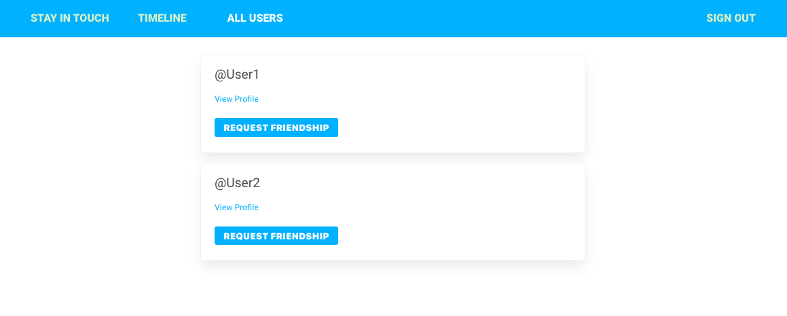

# Social media app built with Ruby on Rails

> A social media app built to practice creating applications with Ruby on Rails.



## Built With

- Ruby 
- Ruby on Rails 

## Live Demo

link


## Getting Started

To get a local copy up and running follow these simple example steps.

### Prerequisites

Ruby: 2.7
Rails: 6
Postgres: >=9.5

### Setup

Instal gems with:

```
bundle install
```

Setup database with:

```
   rails db:create
   rails db:migrate
```

### Github Actions

To make sure the linters' checks using Github Actions work properly, you should follow the next steps:

1. On your recently forked repo, enable the GitHub Actions in the Actions tab.
2. Create the `feature/branch` and push.
3. Start working on your milestone as usual.
4. Open a PR from the `feature/branch` when your work is done.


### Usage

Start server with:

```
    rails server
```

Open `http://localhost:3000/` in your browser.

### Run tests

> To run tests open the terminal and run `bundle exec rspec`

```
    rpsec --format documentation
```

## Authors

👤 **Mark Rode**

-   Github: [@m15e](https://github.com/m15e)

👤 **Brandon Defoe**

-   Github: [@defoebrand](https://github.com/defoebrand)
-   LinkedIn: [@defoebrand](https://www.linkedin.com/in/defoebrand/)
-   Gmail: <mailto:defoe.brand@gmail.com>


## Show your support

Give a ⭐️ if you like this project!

## Acknowledgments

-   Microverse

## 📝 License

This project is [MIT](lic.url) licensed.

